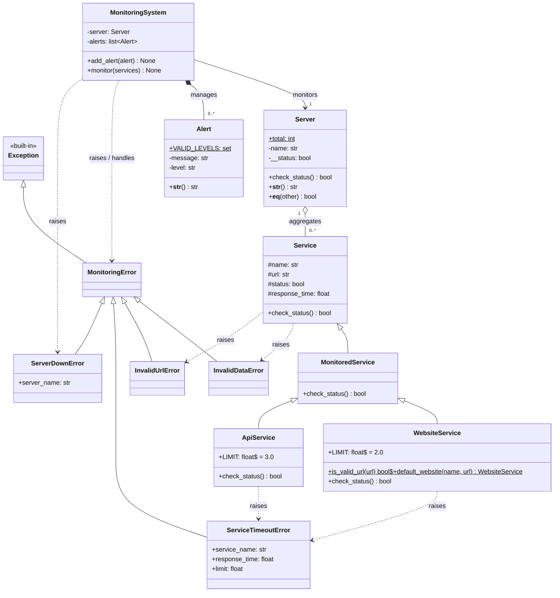

```bash
python main.py
```

## Class Diagram


```mermaid
classDiagram
    class Exception {
        <<built-in>>
    }
    class MonitoringError
    class InvalidDataError
    class InvalidUrlError
    class ServiceTimeoutError {
        +service_name: str
        +response_time: float
        +limit: float
    }
    class ServerDownError {
        +server_name: str
    }

    Exception <|-- MonitoringError
    MonitoringError <|-- InvalidDataError
    MonitoringError <|-- InvalidUrlError
    MonitoringError <|-- ServiceTimeoutError
    MonitoringError <|-- ServerDownError

    class Server {
        +total: int$
        -name: str
        -__status: bool
        +check_status() bool
        +__str__() str
        +__eq__(other) bool
    }

    class Service {
        #name: str
        #url: str
        #status: bool
        #response_time: float
        +check_status() bool
    }

    class MonitoredService {
        +check_status() bool
    }

    class WebsiteService {
        +LIMIT: float$ = 2.0
        +is_valid_url(url) bool$+default_website(name, url) WebsiteService$
        +check_status() bool
    }

    class ApiService {
        +LIMIT: float$ = 3.0
        +check_status() bool
    }

    class Alert {
        +VALID_LEVELS: set$
        -message: str
        -level: str
        +__str__() str
    }

    class MonitoringSystem {
        -server: Server
        -alerts: list~Alert~
        +add_alert(alert) None
        +monitor(services) None
    }

    Service <|-- MonitoredService
    MonitoredService <|-- WebsiteService
    MonitoredService <|-- ApiService

    Server "1" o-- "0..*" Service : aggregates
    MonitoringSystem --> "1" Server : monitors
    MonitoringSystem *-- "0..*" Alert : manages
    MonitoringSystem ..> MonitoringError : raises / handles
    Service ..> InvalidDataError : raises
    Service ..> InvalidUrlError : raises
    WebsiteService ..> ServiceTimeoutError : raises
    ApiService ..> ServiceTimeoutError : raises
    MonitoringSystem ..> ServerDownError : raises
```
````[cite: 1]
